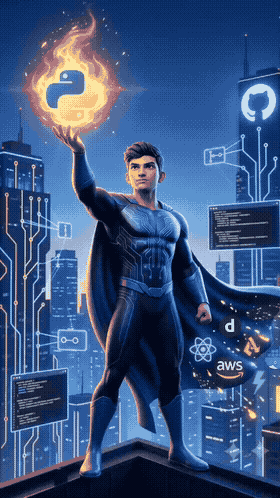

<div align="center">


### Data Science • Machine Learning • IoT • Advanced Python

```python
while True:
    print("Building Intelligent Solutions 🚀")
```

[](https://git.io/typing-svg)

</div>

---

## 🟪 About Me

<table>
<tr>
<td width="52%" valign="top">

I am an **AI & Data Science student** passionate about transforming ideas into intelligent, scalable, and real-world solutions.

My interests span across **Artificial Intelligence, Machine Learning, Data Science, IoT, and Advanced Python**, where I enjoy building innovative applications that combine software, automation, and intelligent decision-making.

I focus on writing clean, efficient, and maintainable code while continuously exploring modern AI technologies, data-driven solutions, and connected systems.

**▸ Main Focus**
- 🤖 Artificial Intelligence
- 📊 Machine Learning & Data Science
- 🌐 Internet of Things (IoT)
- 🐍 Advanced Python Development

</td>
<td width="48%" valign="top" align="center">


<br/><br/>



</td>
</tr>
</table>

<div align="center">
  
  <br/>
  <sub>🦕 &nbsp;Every developer's spirit animal · offline & unstoppable</sub>
</div>

---

<div align="center">

## 🌐 Socials

[](https://instagram.com/pranit_000)
[](https://linkedin.com/in/pranitdeore)
[](mailto:pranitdeore12345@gmail.com)

</div>

---

## 💻 Tech Stack

**Languages**


**AI / ML**


**Tools & Platforms**


---

## 📊 GitHub Stats

<div align="center">


</div>

---

<div align="center">


[](https://visitcount.itsvg.in)

</div>
